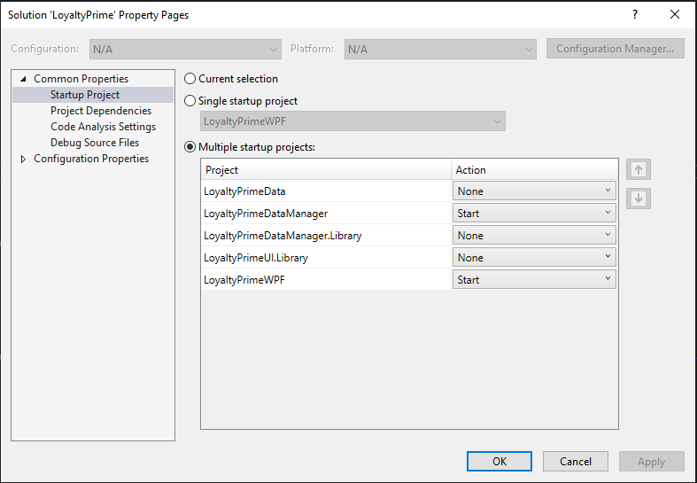
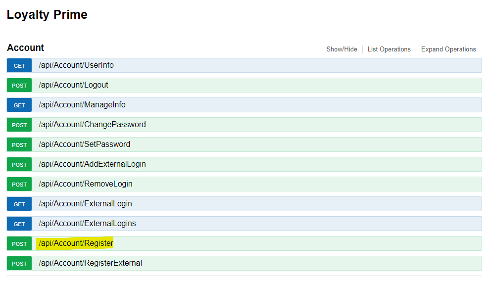
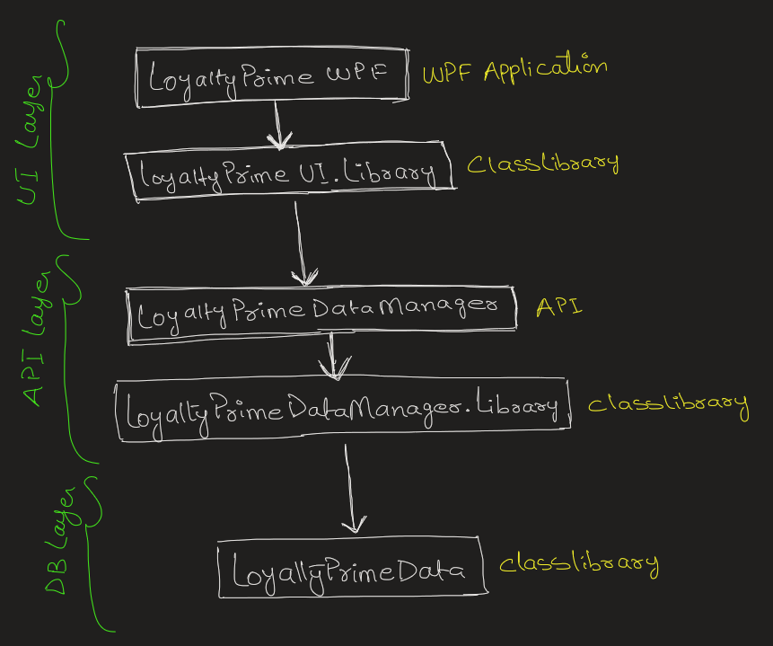

# LoyaltyPrime Member Management System
This is a simple Member Management system where users have to login and sees the list of members (with accounts and balances) and they can add new members, create accounts and assign those accounts to a selected member.

This simple app is divided into front and backend projects. Backend projects contains the API, ClassLibrary and Data class library itself which is just bunch of classes mimicking a database and we have 
front end project contains FrontEnd UI library and WPF application itself.

---
***NOTE: ***
For now, I have only implemented GET feature in API (GET all Members) and in the future we can add PUT, POST, DELETE for members and member accounts. I have only updated the models and also mentioned in comments when 
and where we should add the code to update our database accordingly by calling an API.

## Startup guide

1. Clone the repository 
2. Open it in Visual Studio
3. Select Multi Project Setup (Right click on Solution and select Set Startup Projects)

3. You can use the following credentials to login to WPF Application which requires login
	1. username: awaismemon26@gmail.com
	2. password: Pwd123!
5. If you do not want or cannot use the credentials, then goto https://localhost:44312/swagger, then click Account and POST /api/Account/Register 

6. After you have registered yourself, you can login in WPF application with your username and password

## Design
The motive for this design is to loosly couple code so that if we want to change front end in the future, it would not effect the backend libraries and API. We might have more leverage in adding and removing components from a system without worrying alot about code rewrite or failure.

## Use Cases covered
1. User login 
2. User creates a new account for a defined member
5. User can import existing members in JSON format (**NOTE:** Account Status is boolean, Please Do follow the data type pattern when importing)
6. User can export members with filter criteria

## Application workflow
1. User Logins
2. Can check all members with accounts and balances
3. Can add new member
4. Can add new account for a member
5. Can add same account with balance will update the balance accordingly for only active accounts.
6. Inactive accounts balances are not updated.
7. Can import and export members in JSON format.

## Technologies & Frameworks used
1. .NET Framework 4.8 (in all ClassLibraries & WPF application)
2. Web API MVC (.NET Framework 4.8) with Swagger Implementation
3. Caliburn Micro (for MVVM, Depedency Injection, Binding, Event Aggregator etc.)
4. AutoMapper (simple library for object-to-object mapping library)

### Backend Projects
1. LoyaltyPrimeData (This classlibrary just mimiks a Database and classes which contains the data).
2. LoyaltyPrimeDataManager.Library (This classlibrary is just a layer between API and Database i.e LoyaltyPrimeData. We don't want our API to directly fetch data from Database so this layer which has DataAccess)
3. LoyaltyPrimeDataManager (This is a Web API which front end Library can use to talk to database, any database operation have to go through an API.)

### Frontend Projects
1. LoyaltyPrimeUI.Library (This classlibary basically gets the data from API, this library has API helpers)
2. LoyaltyPrimeWPF (WPF Application which fetches data from LoyaltyPrimeUI Libaray and knows nothing about the database and backend system, it only talks to UI library, doing this way we could add multiple user interfaces in the future and do 
not have to change the libraries or API, we could just get the data from API library and implement Web App or Mobile App )
